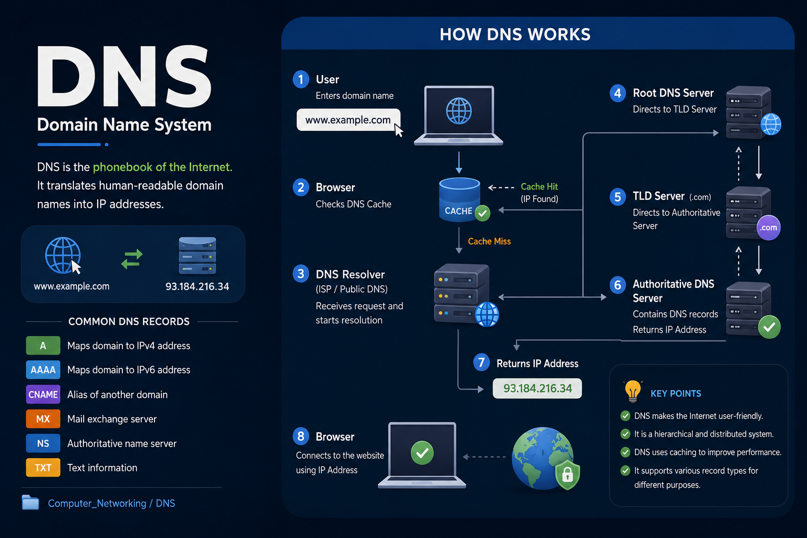

# Domain Name Systeam (DNS)

## What is DNS?
**Domain Name System (DNS)** is a distributed naming system that translates **human-readable domain names** into **IP addresses**.

**Example:**
```text
www.google.com  →  142.250.182.14
```

> DNS is known as the **Phonebook of the Internet** because it converts domain names into IP addresses.

---

## 🎯 Why DNS is Important
- Easy to remember domain names instead of IP addresses.
- Helps browsers locate websites quickly.
- Supports web browsing, email, and other internet services.
- Provides scalability and efficient internet communication.

---

## ⚙️ How DNS Works

```text
User enters www.google.com
          │
          ▼
Browser Cache
          │
          ▼
DNS Resolver
          │
          ▼
Root Server (.)
          │
          ▼
TLD Server (.com)
          │
          ▼
Authoritative DNS Server
          │
          ▼
Returns IP Address
          │
          ▼
Browser loads the website
```

## 🏗️ DNS Hierarchy

```text
            Root (.)
               │
        ┌──────┴──────┐
       .com         .org
         │
      google
         │
   www.google.com
```

---

## 🖥️ Types of DNS Servers

### 1️⃣ Recursive Resolver
- Receives DNS requests from users.
- Finds the required IP address.

### 2️⃣ Root Name Server
- Directs queries to the appropriate TLD server.

### 3️⃣ TLD (Top-Level Domain) Server
- Stores information about domains like `.com`, `.org`, `.edu`, etc.

### 4️⃣ Authoritative Name Server
- Contains the actual DNS records and returns the final IP address.

---

## 📄 Common DNS Records

| Record | Purpose | Example |
|--------|----------|----------|
| **A** | Maps domain to IPv4 address | `google.com → 142.250.182.14` |
| **AAAA** | Maps domain to IPv6 address | `example.com → 2001:db8::1` |
| **CNAME** | Creates an alias for another domain | `mail.example.com → example.com` |
| **MX** | Specifies mail servers | `gmail.com` |
| **NS** | Specifies authoritative name servers | `ns1.example.com` |
| **TXT** | Stores text information | SPF, DKIM |

---

## 🔍 DNS Query Types

### Recursive Query
The DNS server returns the final answer or an error.

### Iterative Query
The DNS server returns the best information it has and refers the client to another server.

---

## ⚡ DNS Caching
DNS temporarily stores resolved domain names to improve performance.

**Advantages:**
- Faster website loading
- Reduced network traffic
- Lower load on DNS servers

---

## 🔐 DNS Security Threats
- **DNS Spoofing:** Redirecting users to fake websites.
- **DNS Cache Poisoning:** Corrupting cached DNS entries.
- **DDoS Attacks:** Overloading DNS servers with excessive requests.

---

## Overview




