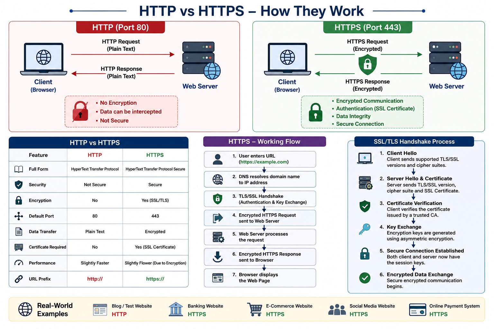

# 🌐 HTTP & HTTPS 

## What is HTTP?

**HTTP (HyperText Transfer Protocol)** is an application layer protocol used for communication between a web browser (client) and a web server. It allows users to request and receive web pages, images, videos, and other resources over the internet.

- **Full Form:** HyperText Transfer Protocol
- **Layer:** Application Layer (TCP/IP Model)
- **Default Port:** 80
- **Protocol Type:** Stateless
- **Transport Protocol:** TCP

---

## 🔄 How HTTP Works

```text
Browser (Client)
       │
       │  HTTP Request
       ▼
Web Server
       │
       │  HTTP Response
       ▼
Browser Displays Web Page
```

### Step-by-Step Process

1. User enters a URL in the browser.
2. Browser sends an **HTTP Request** to the server.
3. Server processes the request.
4. Server sends an **HTTP Response**.
5. Browser displays the requested content.

---

## 📨 HTTP Request Methods

| Method | Description |
|--------|-------------|
| GET | Retrieves data from the server |
| POST | Sends data to the server |
| PUT | Updates existing data |
| DELETE | Removes data from the server |
| PATCH | Partially updates data |

---


## ❌ Limitations of HTTP

- Data is transmitted in **plain text**.
- No encryption or confidentiality.
- Vulnerable to:
  - Eavesdropping
  - Man-in-the-Middle (MITM) attacks
  - Data modification
  - Session hijacking

---

# 🔒 What is HTTPS?

**HTTPS (HyperText Transfer Protocol Secure)** is the secure version of HTTP. It uses **SSL/TLS encryption** to protect communication between the browser and the web server.

- **Full Form:** HyperText Transfer Protocol Secure
- **Layer:** Application Layer
- **Default Port:** 443
- **Protocol Type:** Secure and Encrypted
- **Transport Protocol:** TCP + SSL/TLS

---

## 🔄 How HTTPS Works

```text
Browser (Client)
       │
       │  TLS Handshake
       ▼
Authentication & Encryption
       │
       │  Secure HTTPS Request
       ▼
Web Server
       │
       │  Encrypted HTTPS Response
       ▼
Browser Displays Secure Web Page
```

---

## ✅ Features of HTTPS

- Data Encryption
- Authentication using SSL Certificates
- Data Integrity
- Protection against cyber attacks
- Secure online transactions

---

# ⚖️ HTTP vs HTTPS

| Feature | HTTP | HTTPS |
|---------|------|-------|
| Full Form | HyperText Transfer Protocol | HyperText Transfer Protocol Secure |
| Security | Not Secure | Secure |
| Encryption | No | Yes (SSL/TLS) |
| Default Port | 80 | 443 |
| Data Transfer | Plain Text | Encrypted |
| Certificate Required | No | Yes |
| Performance | Slightly Faster | Slightly Slower due to encryption |
| URL Prefix | `http://` | `https://` |

---


# 🌍 Real-World Examples

| Website Type | Protocol Used |
|--------------|---------------|
| Blog or Test Website | HTTP |
| Banking Website | HTTPS |
| E-Commerce Website | HTTPS |
| Social Media Website | HTTPS |
| Online Payment System | HTTPS |

---

## Overview



# 📝 Key Points

- HTTP is used for transferring web pages and resources over the internet.
- HTTP is **stateless** and uses **Port 80**.
- HTTPS is the secure version of HTTP and uses **SSL/TLS encryption**.
- HTTPS uses **Port 443** and ensures **Confidentiality, Integrity, and Authentication**.
- Modern websites prefer **HTTPS** to protect user data and improve security.
