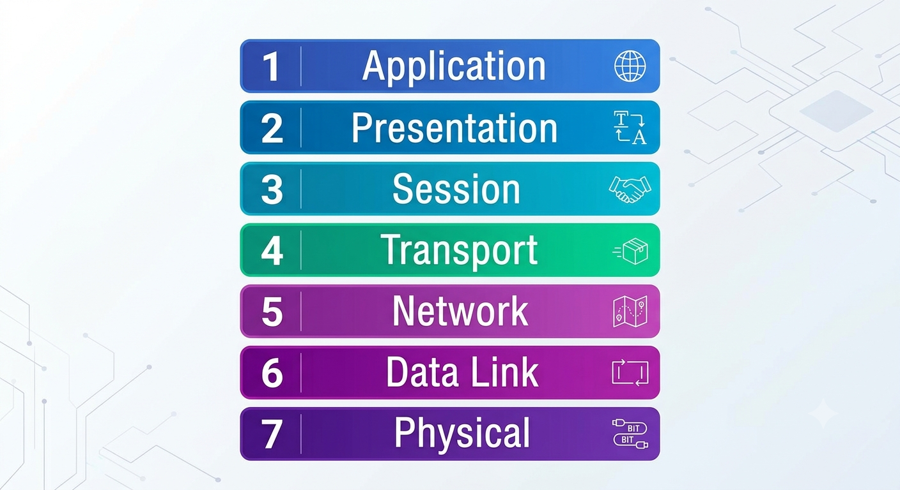
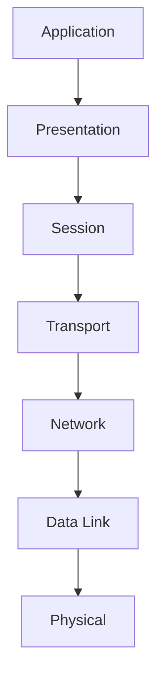

# Computer Networking

  Computer Networking means Number of computer are placed at different location connected through the network so they can share/transport the resources through that network is called computer networking 
  
OR

Computer Networking is the process of connecting two or more computers or devices so they can communicate and share data, resources, and services with each other.

## Diagram

# 🌐 OSI (Open Systems Interconnection) Model

## 📖 Introduction

The **OSI (Open Systems Interconnection) Model** is a conceptual framework developed by the International Organization for Standardization (ISO) to standardize communication between different computer systems.

It divides the communication process into **7 different layers**, where each layer performs a specific task.

The main purpose of the OSI model is to ensure that hardware and software from different vendors can communicate with each other.

Although the Internet mainly follows the TCP/IP model, the OSI model is widely used for learning networking concepts and troubleshooting network issues.

## 🎯 Why Do We Need the OSI Model?

Before the OSI model, every company developed its own networking protocols, making communication between different devices difficult.

The OSI model solves this problem by:

- Standardizing communication
- Reducing complexity
- Improving interoperability
- Simplifying troubleshooting
- Allowing independent development of each layer

## 🖼️ OSI Model Diagram

## 🔄 Data Flow

# 📚 Seven Layers of the OSI Model

## 7️⃣ Application Layer

### Purpose

Application layer provides network services directly to end users and applications.

### Responsibilities

- Email
- Web browsing
- File transfer
- Remote login

### Protocols used in Application Layer

- HTTP
- HTTPS
- FTP
- SMTP
- DNS

### Devices

- Computer
- Mobile
- Browser

### Real-Life Example

When you open YouTube in your browser, the request starts from the Application Layer.

## 6️⃣ Presentation Layer

### Purpose

Converts data into a readable format.

### Responsibilities

- Encryption
- Decryption
- Compression
- Data translation

### Example

HTTPS encrypts data before sending it.

## 5️⃣ Session Layer

### Purpose

The Session layer is the layer that start, manage and end conversation between two devices on a network. 

### Responsibilities

- Session establishment
- Synchronization
- Session termination

### Example

A Zoom meeting remains active because of the Session Layer.

## 4️⃣ Transport Layer

### Purpose

The Transport Layer is the layer that delivers your data reliably and in the correct order from one device to another.

Ensures reliable data transfer.

### Responsibilities

- Error checking
- Flow control
- Segmentation
- Reassembly

### Protocols used in Transport Layer

- TCP (Transport Control Protocol)
- UDP (User Datagram Protocol)

### Example

While downloading a file, TCP ensures that all packets arrive correctly.

## 3️⃣ Network Layer

### Purpose

The Network Layer is the layer that finds the best path for data to travel across different networks from the sender to the receiver.
Determines the best path for data.

### Responsibilities

- Routing
- Logical addressing
- Packet forwarding

### Protocol

- IP (Internet Protocol)

### Devices

- Router

### Example

Routers use IP addresses to forward packets across networks.

## 2️⃣ Data Link Layer

### Purpose

Data Link Layer Transfers data between two directly connected devices.

### Responsibilities

- MAC addressing
- Error detection
- Frame creation

### Devices

- Switch
- Bridge

### Example

A switch forwards frames using MAC addresses.

## 1️⃣ Physical Layer

### Purpose

The Physical Layer is the layer that handles the actual physical equipment and electrical signals used to send data.
Transmits raw bits over physical media.

### Responsibilities

- Electrical signals
- Fiber optics
- Radio signals

### Devices

- Hub
- Repeater
- Cable

### Example

Ethernet cables carry bits between computers.
