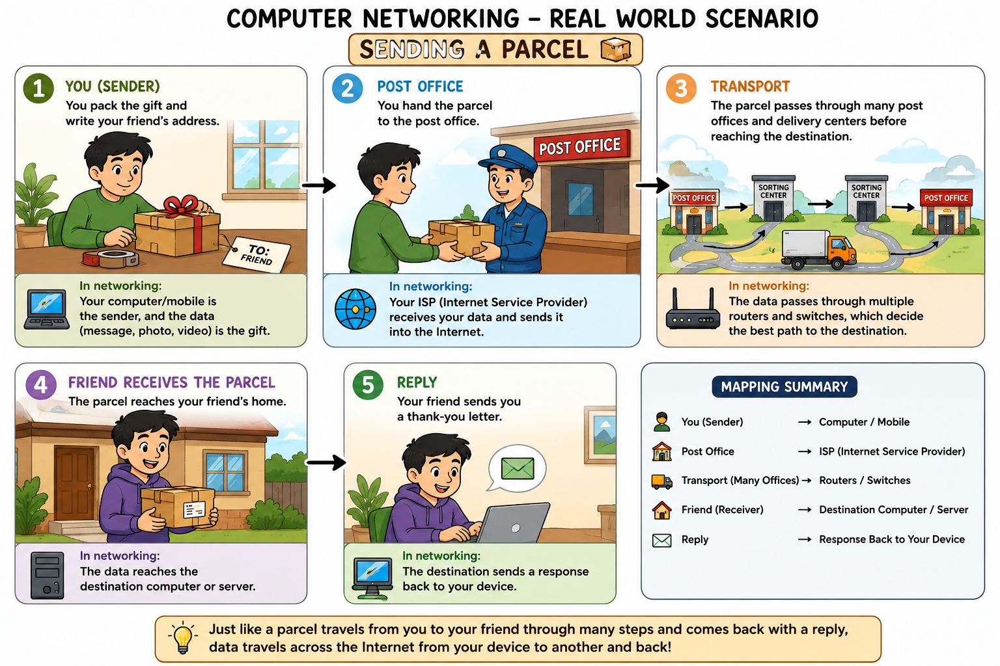

# Computer Networking

  Computer Networking means Number of computer are placed at different location connected through the network so they can share/transport the resources through that network is called computer networking 
  
OR

Computer Networking is the process of connecting two or more computers or devices so they can communicate and share data, resources, and services with each other.

## Diagram

