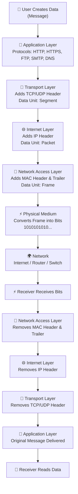

# 🌐 TCP/IP Model (Transmission Control Protocol / Internet Protocol)

> Complete Notes for Computer Networking
>
> ---

# Table of Contents

1. Introduction
2. What is TCP/IP?
3. Why TCP/IP is Important?
4. Features of TCP/IP
5. TCP/IP Architecture
6. Four Layers of TCP/IP
7. Encapsulation Process
8. Data Flow in TCP/IP
9. Protocols in Each Layer

---

# 1. Introduction

The **TCP/IP Model** is the standard communication model used on the Internet.

It defines **how computers communicate with each other** over a network.

Whenever you:

- Open Google
- Watch YouTube
- Send WhatsApp messages
- Browse Instagram
- Download files

your device uses the **TCP/IP protocol suite**.

Without TCP/IP, the Internet would not exist.

## 🖼️ TCP-IP Model Diagram


# 2. What is TCP/IP?

**TCP/IP** stands for

- **TCP** → Transmission Control Protocol
- **IP** → Internet Protocol

It is a collection (suite) of networking protocols used for communication between computers.

### Definition

> TCP/IP is a protocol suite that provides reliable communication and data transfer over interconnected networks.

---


# 3. Why TCP/IP is Important?

Imagine sending a courier.

You write:

- Sender Address
- Receiver Address

The courier company:

- Packs
- Transfers
- Routes
- Delivers

Similarly,

TCP/IP

- Creates data
- Adds addresses
- Sends data
- Delivers correctly


# 4. Features of TCP/IP

✔ Reliable communication
✔ Error detection
✔ Packet switching
✔ Scalability
✔ Platform independent
✔ Open standard
✔ Supports routing
✔ End-to-end communication
✔ Fault tolerant
✔ Supports multiple applications


# 5. TCP/IP Architecture

```

Application Layer
↓
Transport Layer
↓
Internet Layer
↓
Network Access Layer
↓
Physical Network

```

Unlike the OSI Model (7 layers), TCP/IP has **4 layers**.

---

# 6. Four Layers of TCP/IP

---
# Layer 4 — Application Layer

## Purpose

Provides services directly to user applications.

It combines the functions of

- Application
- Presentation
- Session

from the OSI model.

---

## Responsibilities

- Email
- Web browsing
- File transfer
- Remote login
- Name resolution

---

## Common Protocols

| Protocol | Full Form | Purpose |
|-----------|----------|----------|
| HTTP | HyperText Transfer Protocol | Web browsing |
| HTTPS | HTTP Secure | Secure websites |
| FTP | File Transfer Protocol | File transfer |
| SMTP | Simple Mail Transfer Protocol | Send emails |
| POP3 | Post Office Protocol | Receive email |
| IMAP | Internet Message Access Protocol | Manage emails |
| DNS | Domain Name System | Converts domain names to IP addresses |
| DHCP | Dynamic Host Configuration Protocol | Assigns IP addresses |
| SSH | Secure Shell | Secure remote login |
| Telnet | Remote login | Unsecured remote access |

---

## Data Unit

**Message**

---

## Devices Used

- Computer
- Mobile
- Laptop
- Server

---

# Layer 3 — Transport Layer

## Purpose

Provides end-to-end communication between devices.

This layer ensures:

- Reliable delivery
- Error checking
- Flow control
- Segmentation
- Reassembly

---

## Main Protocols

### TCP (Transmission Control Protocol)

Reliable protocol.

Features

- Connection-oriented
- Error recovery
- Flow control
- Acknowledgement
- Retransmission

Examples

- Gmail
- Banking
- Online shopping
- WhatsApp messages

---

### UDP (User Datagram Protocol)

Unreliable protocol.

Features

- Fast
- No acknowledgements
- No retransmission
- Low overhead

Examples

- Online games
- Video calls
- Live streaming
- DNS queries

---

## Data Unit

**Segment**

---

# Layer 2 — Internet Layer

## Purpose

Responsible for logical addressing and routing.

It decides

> Which path should packets take?

---

## Responsibilities

- IP addressing
- Routing
- Packet forwarding
- Fragmentation

---

## Protocols

### IP

Provides logical addressing.

Versions

- IPv4 (Internet Protocol version 4)
- IPv6 (Internet Protocol version 6)

---

### ICMP

Used for

- Ping
- Error messages

---

### ARP

Converts

IP Address

↓

MAC Address

---

### RARP

Converts

MAC Address

↓

IP Address

---

### IGMP

Used for multicast communication.

---

## Devices

Routers

---

## Data Unit

**Packet**

---

# Layer 1 — Network Access Layer

Also called

- Link Layer
- Network Interface Layer

---

## Purpose

Responsible for sending bits over the physical network.

---

## Responsibilities

- Framing
- MAC Addressing
- Error detection
- Physical transmission

---

## Technologies

- Ethernet
- Wi-Fi
- Fiber
- Bluetooth

---

## Devices

- Switch
- Hub
- NIC

---

## Data Unit

Frame

Then converted into

Bits

---


# 7. Encapsulation Process in TCP/IP Model

> **Definition:**
>
> **Encapsulation = Wrapping data with the necessary information at each layer so it can travel safely and reach the correct destination.**

---
# 📊 Encapsulation Process

```text
Application Layer
        │
        ▼
   Message (Data)
        │
        ▼
Transport Layer
Adds TCP/UDP Header
        │
        ▼
      Segment
        │
        ▼
Internet Layer
Adds IP Header
        │
        ▼
      Packet
        │
        ▼
Network Access Layer
Adds MAC Header + Trailer
        │
        ▼
      Frame
        │
        ▼
Physical Medium
Converts Frame into Bits
        │
        ▼
101010101010101...
```

---


# 8. Data Flow in TCP/IP Model

The following flowchart illustrates how data travels from the sender to the receiver through the TCP/IP layers.



---


