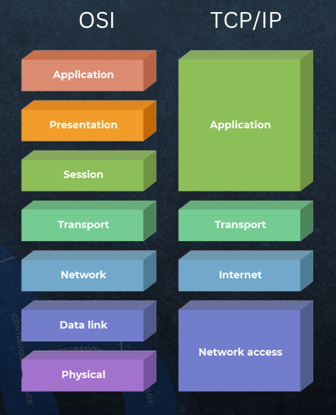

# 🌐 TCP/IP Model (Transmission Control Protocol / Internet Protocol)

> Complete Notes for Computer Networking
>
> ---

# Table of Contents

1. Introduction
2. What is TCP/IP?
3. Why TCP/IP is Important?
4. Features of TCP/IP
5. TCP/IP Architecture
6. Four Layers of TCP/IP
7. Encapsulation Process
8. Data Flow in TCP/IP
9. Protocols in Each Layer

---

# 1. Introduction

The **TCP/IP Model** is the standard communication model used on the Internet.

It defines **how computers communicate with each other** over a network.

Whenever you:

- Open Google
- Watch YouTube
- Send WhatsApp messages
- Browse Instagram
- Download files

your device uses the **TCP/IP protocol suite**.

Without TCP/IP, the Internet would not exist.

## 🖼️ TCP-IP Model Diagram




# 2. What is TCP/IP?

**TCP/IP** stands for

- **TCP** → Transmission Control Protocol
- **IP** → Internet Protocol

It is a collection (suite) of networking protocols used for communication between computers.

### Definition

> TCP/IP is a protocol suite that provides reliable communication and data transfer over interconnected networks.

---


# 3. Why TCP/IP is Important?

Imagine sending a courier.

You write:

- Sender Address
- Receiver Address

The courier company:

- Packs
- Transfers
- Routes
- Delivers

Similarly,

TCP/IP

- Creates data
- Adds addresses
- Sends data
- Delivers correctly


# 4. Features of TCP/IP

✔ Reliable communication
✔ Error detection
✔ Packet switching
✔ Scalability
✔ Platform independent
✔ Open standard
✔ Supports routing
✔ End-to-end communication
✔ Fault tolerant
✔ Supports multiple applications


# 5. TCP/IP Architecture

```

Application Layer
↓
Transport Layer
↓
Internet Layer
↓
Network Access Layer
↓
Physical Network

```

Unlike the OSI Model (7 layers), TCP/IP has **4 layers**.

---
